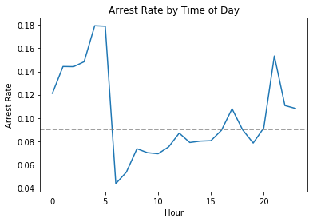
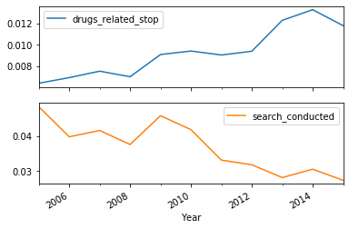
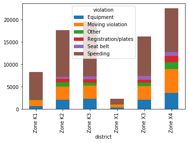
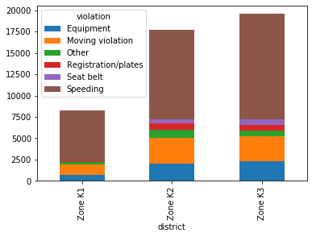
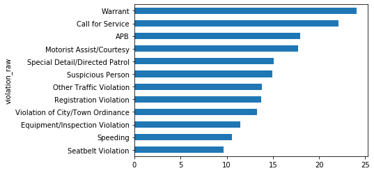
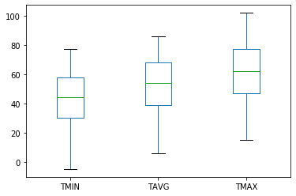
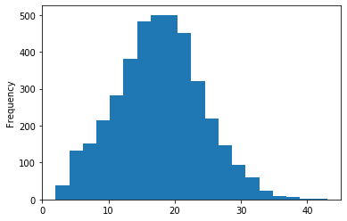
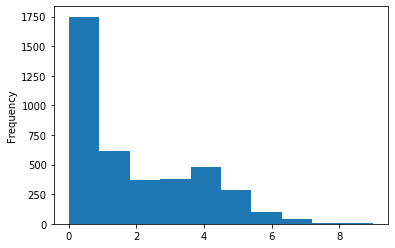

# Analyzing Police Activity Dataset
Exploring the Stanford Open Policing Project dataset and analyzing the impact of gender on police behavior.

## Preparing and Cleaning Data

### Inpect data and look at missing values


```python
import pandas as pd

#Read Data
ts = pd.read_csv("datasets\police_traffic_stops.csv")
display(ts.head())

#Dataframe Info
display(ts.info())


#Look for missing values
display(ts.isnull().sum())
display(ts.shape)
```


<div>
<style scoped>
    .dataframe tbody tr th:only-of-type {
        vertical-align: middle;
    }

    .dataframe tbody tr th {
        vertical-align: top;
    }

    .dataframe thead th {
        text-align: right;
    }
</style>
<table border="1" class="dataframe">
  <thead>
    <tr style="text-align: right;">
      <th></th>
      <th>state</th>
      <th>stop_date</th>
      <th>stop_time</th>
      <th>county_name</th>
      <th>driver_gender</th>
      <th>driver_race</th>
      <th>violation_raw</th>
      <th>violation</th>
      <th>search_conducted</th>
      <th>search_type</th>
      <th>stop_outcome</th>
      <th>is_arrested</th>
      <th>stop_duration</th>
      <th>drugs_related_stop</th>
      <th>district</th>
    </tr>
  </thead>
  <tbody>
    <tr>
      <th>0</th>
      <td>RI</td>
      <td>2005-01-04</td>
      <td>12:55</td>
      <td>NaN</td>
      <td>M</td>
      <td>White</td>
      <td>Equipment/Inspection Violation</td>
      <td>Equipment</td>
      <td>False</td>
      <td>NaN</td>
      <td>Citation</td>
      <td>False</td>
      <td>0-15 Min</td>
      <td>False</td>
      <td>Zone X4</td>
    </tr>
    <tr>
      <th>1</th>
      <td>RI</td>
      <td>2005-01-23</td>
      <td>23:15</td>
      <td>NaN</td>
      <td>M</td>
      <td>White</td>
      <td>Speeding</td>
      <td>Speeding</td>
      <td>False</td>
      <td>NaN</td>
      <td>Citation</td>
      <td>False</td>
      <td>0-15 Min</td>
      <td>False</td>
      <td>Zone K3</td>
    </tr>
    <tr>
      <th>2</th>
      <td>RI</td>
      <td>2005-02-17</td>
      <td>04:15</td>
      <td>NaN</td>
      <td>M</td>
      <td>White</td>
      <td>Speeding</td>
      <td>Speeding</td>
      <td>False</td>
      <td>NaN</td>
      <td>Citation</td>
      <td>False</td>
      <td>0-15 Min</td>
      <td>False</td>
      <td>Zone X4</td>
    </tr>
    <tr>
      <th>3</th>
      <td>RI</td>
      <td>2005-02-20</td>
      <td>17:15</td>
      <td>NaN</td>
      <td>M</td>
      <td>White</td>
      <td>Call for Service</td>
      <td>Other</td>
      <td>False</td>
      <td>NaN</td>
      <td>Arrest Driver</td>
      <td>True</td>
      <td>16-30 Min</td>
      <td>False</td>
      <td>Zone X1</td>
    </tr>
    <tr>
      <th>4</th>
      <td>RI</td>
      <td>2005-02-24</td>
      <td>01:20</td>
      <td>NaN</td>
      <td>F</td>
      <td>White</td>
      <td>Speeding</td>
      <td>Speeding</td>
      <td>False</td>
      <td>NaN</td>
      <td>Citation</td>
      <td>False</td>
      <td>0-15 Min</td>
      <td>False</td>
      <td>Zone X3</td>
    </tr>
  </tbody>
</table>
</div>


    <class 'pandas.core.frame.DataFrame'>
    RangeIndex: 91741 entries, 0 to 91740
    Data columns (total 15 columns):
     #   Column              Non-Null Count  Dtype  
    ---  ------              --------------  -----  
     0   state               91741 non-null  object 
     1   stop_date           91741 non-null  object 
     2   stop_time           91741 non-null  object 
     3   county_name         0 non-null      float64
     4   driver_gender       86536 non-null  object 
     5   driver_race         86539 non-null  object 
     6   violation_raw       86539 non-null  object 
     7   violation           86539 non-null  object 
     8   search_conducted    91741 non-null  bool   
     9   search_type         3307 non-null   object 
     10  stop_outcome        86539 non-null  object 
     11  is_arrested         86539 non-null  object 
     12  stop_duration       86539 non-null  object 
     13  drugs_related_stop  91741 non-null  bool   
     14  district            91741 non-null  object 
    dtypes: bool(2), float64(1), object(12)
    memory usage: 9.3+ MB
    


    None


    state                     0
    stop_date                 0
    stop_time                 0
    county_name           91741
    driver_gender          5205
    driver_race            5202
    violation_raw          5202
    violation              5202
    search_conducted          0
    search_type           88434
    stop_outcome           5202
    is_arrested            5202
    stop_duration          5202
    drugs_related_stop        0
    district                  0
    dtype: int64


    (91741, 15)


### Drop rows/columns

  1. Drop county_name column as all values in the column are NaN. Drop State column as data is for a single state.
  2. Drop rows without stop date and stop time column


```python
# Drop state and county_name
display(ts['state'].value_counts())
ts.drop(['county_name','state'], axis='columns', inplace=True)

#Drop rows with NaN stop_date and stop_time
ts.dropna(subset=['stop_date', 'stop_time'], inplace=True)

display(ts.shape)
```


    RI    91741
    Name: state, dtype: int64


    (91741, 13)


### Using proper data types
1. Change is_arrested to boolean
2. Combine stop_date and stop_time columns to create pandas datetime object and set it as index of data frame


```python
#Look at column data types
display(ts.dtypes)

#Change is_arrested to boolean
display(ts['is_arrested'].value_counts())
ts['is_arrested'] = ts['is_arrested'].astype('bool')

#Combine stop date and stop time to create pandas date time object
ts['stop_datetime'] = pd.to_datetime(ts['stop_date'].str.cat(ts['stop_time'], sep=" "))

display(ts.dtypes)

#Set datetime as index of dataframe
ts.set_index('stop_datetime', inplace=True)
```


    stop_date             object
    stop_time             object
    driver_gender         object
    driver_race           object
    violation_raw         object
    violation             object
    search_conducted        bool
    search_type           object
    stop_outcome          object
    is_arrested           object
    stop_duration         object
    drugs_related_stop      bool
    district              object
    dtype: object


    False    83461
    True      3078
    Name: is_arrested, dtype: int64


    stop_date                     object
    stop_time                     object
    driver_gender                 object
    driver_race                   object
    violation_raw                 object
    violation                     object
    search_conducted                bool
    search_type                   object
    stop_outcome                  object
    is_arrested                     bool
    stop_duration                 object
    drugs_related_stop              bool
    district                      object
    stop_datetime         datetime64[ns]
    dtype: object


## Exploring Relationship between Gender and Policing

### Examine Traffic Violations  and Comparing Violations by Gender


```python
#Examine Traffic Violations
display(ts['violation'].value_counts(normalize=True))

#Compare Violations by gender
female = ts[ts['driver_gender']=='F']
male = ts[ts['driver_gender']=='M']

display(female['violation'].value_counts(normalize=True))
display(male['violation'].value_counts(normalize=True))

#Single line
display(ts.groupby('driver_gender')['violation'].value_counts(normalize=True))
```


    Speeding               0.559563
    Moving violation       0.187476
    Equipment              0.126209
    Other                  0.050960
    Registration/plates    0.042790
    Seat belt              0.033002
    Name: violation, dtype: float64


    Speeding               0.658114
    Moving violation       0.138218
    Equipment              0.105199
    Registration/plates    0.044418
    Other                  0.029738
    Seat belt              0.024312
    Name: violation, dtype: float64


    Speeding               0.522243
    Moving violation       0.206144
    Equipment              0.134158
    Other                  0.058985
    Registration/plates    0.042175
    Seat belt              0.036296
    Name: violation, dtype: float64


    driver_gender  violation          
    F              Speeding               0.658114
                   Moving violation       0.138218
                   Equipment              0.105199
                   Registration/plates    0.044418
                   Other                  0.029738
                   Seat belt              0.024312
    M              Speeding               0.522243
                   Moving violation       0.206144
                   Equipment              0.134158
                   Other                  0.058985
                   Registration/plates    0.042175
                   Seat belt              0.036296
    Name: violation, dtype: float64


### Effect of Gender on Speeding Tickets


```python
# Compare data by gender for speeding violation
female_speeding  = ts[(ts['driver_gender']=='F') & (ts['violation']=='Speeding')]
male_speeding  = ts[(ts['driver_gender']=='M') & (ts['violation']=='Speeding')]

display(female_speeding['stop_outcome'].value_counts(normalize=True))
display(male_speeding['stop_outcome'].value_counts(normalize=True))

#Single Line
ts[ts['violation']=='Speeding'].groupby('driver_gender')['stop_outcome'].value_counts(normalize=True)
```


    Citation            0.952192
    Warning             0.040074
    Arrest Driver       0.005752
    N/D                 0.000959
    Arrest Passenger    0.000639
    No Action           0.000383
    Name: stop_outcome, dtype: float64


    Citation            0.944595
    Warning             0.036184
    Arrest Driver       0.015895
    Arrest Passenger    0.001281
    No Action           0.001068
    N/D                 0.000976
    Name: stop_outcome, dtype: float64


    driver_gender  stop_outcome    
    F              Citation            0.952192
                   Warning             0.040074
                   Arrest Driver       0.005752
                   N/D                 0.000959
                   Arrest Passenger    0.000639
                   No Action           0.000383
    M              Citation            0.944595
                   Warning             0.036184
                   Arrest Driver       0.015895
                   Arrest Passenger    0.001281
                   No Action           0.001068
                   N/D                 0.000976
    Name: stop_outcome, dtype: float64


### Effect of Gender on Vehicle Search


```python
# Compare data by gender on Vehicle Search
ts.groupby(['driver_gender'])['search_conducted'].mean()
```


    driver_gender
    F    0.019181
    M    0.045426
    Name: search_conducted, dtype: float64


It  seems that search rate for males is much higher than females. Search rate might depend on violation type as well.


```python
# Compare search rate by gender and violation
ts.groupby(['violation','driver_gender'])['search_conducted'].mean()
```


    violation            driver_gender
    Equipment            F                0.039984
                         M                0.071496
    Moving violation     F                0.039257
                         M                0.061524
    Other                F                0.041018
                         M                0.046191
    Registration/plates  F                0.054924
                         M                0.108802
    Seat belt            F                0.017301
                         M                0.035119
    Speeding             F                0.008309
                         M                0.027885
    Name: search_conducted, dtype: float64


### Effect of  Gender on Frisking


```python
# Use search type to look at rows with 'Protective Frisk'
display(ts['search_type'].value_counts())

# Since search type can have multiple values, containment need to be checked
ts['frisk'] = ts['search_type'].str.contains('Protective Frisk', na=False)

# Frisk condcuted by gender when vehicle was searched
display(ts[(ts['search_conducted'])].groupby('driver_gender')['frisk'].mean())

```


    Incident to Arrest                                          1290
    Probable Cause                                               924
    Inventory                                                    219
    Reasonable Suspicion                                         214
    Protective Frisk                                             164
    Incident to Arrest,Inventory                                 123
    Incident to Arrest,Probable Cause                            100
    Probable Cause,Reasonable Suspicion                           54
    Incident to Arrest,Inventory,Probable Cause                   35
    Probable Cause,Protective Frisk                               35
    Incident to Arrest,Protective Frisk                           33
    Inventory,Probable Cause                                      25
    Protective Frisk,Reasonable Suspicion                         19
    Incident to Arrest,Inventory,Protective Frisk                 18
    Incident to Arrest,Probable Cause,Protective Frisk            13
    Inventory,Protective Frisk                                    12
    Incident to Arrest,Reasonable Suspicion                        8
    Incident to Arrest,Probable Cause,Reasonable Suspicion         5
    Probable Cause,Protective Frisk,Reasonable Suspicion           5
    Incident to Arrest,Inventory,Reasonable Suspicion              4
    Inventory,Reasonable Suspicion                                 2
    Incident to Arrest,Protective Frisk,Reasonable Suspicion       2
    Inventory,Probable Cause,Reasonable Suspicion                  1
    Inventory,Protective Frisk,Reasonable Suspicion                1
    Inventory,Probable Cause,Protective Frisk                      1
    Name: search_type, dtype: int64


    driver_gender
    F    0.074561
    M    0.094353
    Name: frisk, dtype: float64


## Visualizing Exploratory Data Analysis

### Does time of day affect arrest rate ?
Plot hourly arrrest rate and compare with overall rate.


```python
# Overall Arrest Rate
overall_arrest_rate = ts['is_arrested'].mean()

#Calculate hourly Arrest Rate. Resampling can also be used (used in next example)
hourly_arrest_rate = ts.groupby(ts.index.hour)['is_arrested'].mean()

# Plot Hourly Arrest Rate on a line chart
import matplotlib.pyplot as plt

# Create a line plot of 'hourly_arrest_rate'
plt.plot(hourly_arrest_rate)

# Add the xlabel, ylabel, and title
plt.xlabel("Hour")
plt.ylabel("Arrest Rate")
plt.title("Arrest Rate by Time of Day")

# Add reference line for overall Arrest Rate
plt.axhline(y=overall_arrest_rate, color='gray', linestyle='--')

# Display the plot
plt.show()
```





The arrest rate has a significant spike overnight, and then dips in the early morning hours.


### Are drug related stops on the rise ?
Visulalize Annual Search Rate and Drug Related Stops to see the trend over time.


```python
# Calculate annual trend by resampling data and plot line charts
annual_trend = ts.resample('A')[['drugs_related_stop','search_conducted']].mean()
annual_trend.plot(subplots=True)
plt.xlabel("Year")
plt.show()
```





The rate of drug-related stops increased even though the search rate decreased.


### What violations are caught in each district ?
Plot Violations by District


```python
# Create a crosstab and display a bar chart for each district
violations_by_zone =  pd.crosstab(ts['district'], ts['violation'])
violations_by_zone.plot(kind="bar",  stacked=True)
plt.show()

#Plot  only  for  K Zones
k_zones = violations_by_zone.loc['Zone  K1':'Zone K3']
k_zones.plot(kind="bar",  stacked=True)
plt.show()
```








###  How  long  is a stop for a violation ?


```python
# Print the unique values in 'stop_duration'
display(ts.stop_duration.unique())

# Create a dictionary that maps strings to integers
mapping = {'0-15 Min':8, '16-30 Min':23, '30+ Min':45} 

# Convert the 'stop_duration' strings to integers using the 'mapping'
ts['stop_minutes'] = ts.stop_duration.map(mapping)

# Print the unique values in 'stop_minutes'
display(ts['stop_minutes'].unique())

# Calculate the mean 'stop_minutes' for each value in 'violation_raw'
stop_length = ts.groupby('violation_raw')['stop_minutes'].mean()

# Sort 'stop_length' by its values and create a horizontal bar plot
stop_length.sort_values().plot(kind='barh')

# Display the plot
plt.show()
```


    array(['0-15 Min', '16-30 Min', nan, '30+ Min'], dtype=object)


    array([ 8., 23., nan, 45.])





## Analyzing effect of weather on policing
Combbining weather dataset with policing dataset to explore the impact of weather conditions on police behavior during traffic stops.

### Exploring weather dataset


```python
# Read weather dataset
weather = pd.read_csv("datasets/weather_data.csv")
display(weather.head())

# Examine temperature columns for sanity: TMIN, TAVG, TMAX
display(weather[['TMIN','TAVG','TMAX']].describe())

# Visually examine with box plot
weather[['TMIN','TAVG','TMAX']].plot(kind="box")
plt.show()

# Ensure TMIN is always less than TMAX
# Create a 'TDIFF' column that represents temperature difference
weather['TDIFF'] = weather['TMAX'] - weather['TMIN']

# Describe the 'TDIFF' column
print(weather['TDIFF'].describe())

# Create a histogram with 20 bins to visualize 'TDIFF'
weather['TDIFF'].plot(kind='hist', bins=20)
plt.show()
```


<div>
<style scoped>
    .dataframe tbody tr th:only-of-type {
        vertical-align: middle;
    }

    .dataframe tbody tr th {
        vertical-align: top;
    }

    .dataframe thead th {
        text-align: right;
    }
</style>
<table border="1" class="dataframe">
  <thead>
    <tr style="text-align: right;">
      <th></th>
      <th>STATION</th>
      <th>DATE</th>
      <th>TAVG</th>
      <th>TMIN</th>
      <th>TMAX</th>
      <th>AWND</th>
      <th>WSF2</th>
      <th>WT01</th>
      <th>WT02</th>
      <th>WT03</th>
      <th>...</th>
      <th>WT11</th>
      <th>WT13</th>
      <th>WT14</th>
      <th>WT15</th>
      <th>WT16</th>
      <th>WT17</th>
      <th>WT18</th>
      <th>WT19</th>
      <th>WT21</th>
      <th>WT22</th>
    </tr>
  </thead>
  <tbody>
    <tr>
      <th>0</th>
      <td>USW00014765</td>
      <td>2005-01-01</td>
      <td>44.0</td>
      <td>35</td>
      <td>53</td>
      <td>8.95</td>
      <td>25.1</td>
      <td>1.0</td>
      <td>NaN</td>
      <td>NaN</td>
      <td>...</td>
      <td>NaN</td>
      <td>1.0</td>
      <td>NaN</td>
      <td>NaN</td>
      <td>NaN</td>
      <td>NaN</td>
      <td>NaN</td>
      <td>NaN</td>
      <td>NaN</td>
      <td>NaN</td>
    </tr>
    <tr>
      <th>1</th>
      <td>USW00014765</td>
      <td>2005-01-02</td>
      <td>36.0</td>
      <td>28</td>
      <td>44</td>
      <td>9.40</td>
      <td>14.1</td>
      <td>NaN</td>
      <td>NaN</td>
      <td>NaN</td>
      <td>...</td>
      <td>NaN</td>
      <td>NaN</td>
      <td>NaN</td>
      <td>NaN</td>
      <td>1.0</td>
      <td>NaN</td>
      <td>1.0</td>
      <td>NaN</td>
      <td>NaN</td>
      <td>NaN</td>
    </tr>
    <tr>
      <th>2</th>
      <td>USW00014765</td>
      <td>2005-01-03</td>
      <td>49.0</td>
      <td>44</td>
      <td>53</td>
      <td>6.93</td>
      <td>17.0</td>
      <td>1.0</td>
      <td>NaN</td>
      <td>NaN</td>
      <td>...</td>
      <td>NaN</td>
      <td>1.0</td>
      <td>NaN</td>
      <td>NaN</td>
      <td>1.0</td>
      <td>NaN</td>
      <td>NaN</td>
      <td>NaN</td>
      <td>NaN</td>
      <td>NaN</td>
    </tr>
    <tr>
      <th>3</th>
      <td>USW00014765</td>
      <td>2005-01-04</td>
      <td>42.0</td>
      <td>39</td>
      <td>45</td>
      <td>6.93</td>
      <td>16.1</td>
      <td>1.0</td>
      <td>NaN</td>
      <td>NaN</td>
      <td>...</td>
      <td>NaN</td>
      <td>1.0</td>
      <td>1.0</td>
      <td>NaN</td>
      <td>1.0</td>
      <td>NaN</td>
      <td>NaN</td>
      <td>NaN</td>
      <td>NaN</td>
      <td>NaN</td>
    </tr>
    <tr>
      <th>4</th>
      <td>USW00014765</td>
      <td>2005-01-05</td>
      <td>36.0</td>
      <td>28</td>
      <td>43</td>
      <td>7.83</td>
      <td>17.0</td>
      <td>1.0</td>
      <td>NaN</td>
      <td>NaN</td>
      <td>...</td>
      <td>NaN</td>
      <td>1.0</td>
      <td>NaN</td>
      <td>NaN</td>
      <td>1.0</td>
      <td>NaN</td>
      <td>1.0</td>
      <td>NaN</td>
      <td>NaN</td>
      <td>NaN</td>
    </tr>
  </tbody>
</table>
<p>5 rows × 27 columns</p>
</div>


<div>
<style scoped>
    .dataframe tbody tr th:only-of-type {
        vertical-align: middle;
    }

    .dataframe tbody tr th {
        vertical-align: top;
    }

    .dataframe thead th {
        text-align: right;
    }
</style>
<table border="1" class="dataframe">
  <thead>
    <tr style="text-align: right;">
      <th></th>
      <th>TMIN</th>
      <th>TAVG</th>
      <th>TMAX</th>
    </tr>
  </thead>
  <tbody>
    <tr>
      <th>count</th>
      <td>4017.000000</td>
      <td>1217.000000</td>
      <td>4017.000000</td>
    </tr>
    <tr>
      <th>mean</th>
      <td>43.484441</td>
      <td>52.493016</td>
      <td>61.268608</td>
    </tr>
    <tr>
      <th>std</th>
      <td>17.020298</td>
      <td>17.830714</td>
      <td>18.199517</td>
    </tr>
    <tr>
      <th>min</th>
      <td>-5.000000</td>
      <td>6.000000</td>
      <td>15.000000</td>
    </tr>
    <tr>
      <th>25%</th>
      <td>30.000000</td>
      <td>39.000000</td>
      <td>47.000000</td>
    </tr>
    <tr>
      <th>50%</th>
      <td>44.000000</td>
      <td>54.000000</td>
      <td>62.000000</td>
    </tr>
    <tr>
      <th>75%</th>
      <td>58.000000</td>
      <td>68.000000</td>
      <td>77.000000</td>
    </tr>
    <tr>
      <th>max</th>
      <td>77.000000</td>
      <td>86.000000</td>
      <td>102.000000</td>
    </tr>
  </tbody>
</table>
</div>





    count    4017.000000
    mean       17.784167
    std         6.350720
    min         2.000000
    25%        14.000000
    50%        18.000000
    75%        22.000000
    max        43.000000
    Name: TDIFF, dtype: float64
    





### Categorizing the weather
Create ordered category field for weather condition by counting bad weather conditions


```python
# Copy 'WT01' through 'WT22' to a new DataFrame. Each column is a flag indicating bad weather
WT = weather.loc[:,'WT01':'WT22']

# Calculate the sum of each row in 'WT'
weather['bad_conditions'] = WT.sum(axis='columns')

# Replace missing values in 'bad_conditions' with '0'
weather['bad_conditions'] = weather.bad_conditions.fillna(0).astype('int')

# Create a histogram to visualize 'bad_conditions'
weather['bad_conditions'].plot(kind='hist')

# Display the plot
plt.show()
```





It looks like many days didn't have any bad weather conditions, and only a small portion of days had more than four bad weather conditions.

Categorize the weather based on number of bad conditions. Create an ordered categorical variable for weather rating.


```python
# Count the unique values in 'bad_conditions' and sort the index
print(weather['bad_conditions'].value_counts().sort_index())

# Create a dictionary that maps integers to strings
mapping = {0:'good', 1:'bad', 2:'bad', 3:'bad', 4:'bad', 5:'worse', 6:'worse', 7:'worse', 8:'worse', 9:'worse'}

# Convert the 'bad_conditions' integers to strings using the 'mapping'
weather['rating'] = weather['bad_conditions'].map(mapping)

# Count the unique values in 'rating'
print(weather['rating'].value_counts().sort_index())

# Create a list of weather ratings in logical order
cats = ['good', 'bad', 'worse']

# Change the data type of 'rating' to category
weather['rating'] = weather['rating'].astype(pd.api.types.CategoricalDtype(categories = cats))

# Examine the head of 'rating'
print(weather['rating'].head())
```

    0    1749
    1     613
    2     367
    3     380
    4     476
    5     282
    6     101
    7      41
    8       4
    9       4
    Name: bad_conditions, dtype: int64
    bad      1836
    good     1749
    worse     432
    Name: rating, dtype: int64
    0    bad
    1    bad
    2    bad
    3    bad
    4    bad
    Name: rating, dtype: category
    Categories (3, object): [good, bad, worse]
    


### Merging Policing and Weather data
Merge the 2 datasets on date for analysis


```python
# Reset the index of Policing dataset
ts.reset_index(inplace=True)
display(ts.head())

# Create a DataFrame from the 'DATE' and 'rating' columns
weather_rating = weather[['DATE', 'rating']]
display(weather_rating.head())

#Merge the datasets
ts_weather = pd.merge(left=ts, right=weather_rating, left_on='stop_date', right_on='DATE', how='left')
display(ts_weather.head())
```


<div>
<style scoped>
    .dataframe tbody tr th:only-of-type {
        vertical-align: middle;
    }

    .dataframe tbody tr th {
        vertical-align: top;
    }

    .dataframe thead th {
        text-align: right;
    }
</style>
<table border="1" class="dataframe">
  <thead>
    <tr style="text-align: right;">
      <th></th>
      <th>stop_datetime</th>
      <th>stop_date</th>
      <th>stop_time</th>
      <th>driver_gender</th>
      <th>driver_race</th>
      <th>violation_raw</th>
      <th>violation</th>
      <th>search_conducted</th>
      <th>search_type</th>
      <th>stop_outcome</th>
      <th>is_arrested</th>
      <th>stop_duration</th>
      <th>drugs_related_stop</th>
      <th>district</th>
      <th>frisk</th>
      <th>stop_minutes</th>
    </tr>
  </thead>
  <tbody>
    <tr>
      <th>0</th>
      <td>2005-01-04 12:55:00</td>
      <td>2005-01-04</td>
      <td>12:55</td>
      <td>M</td>
      <td>White</td>
      <td>Equipment/Inspection Violation</td>
      <td>Equipment</td>
      <td>False</td>
      <td>NaN</td>
      <td>Citation</td>
      <td>False</td>
      <td>0-15 Min</td>
      <td>False</td>
      <td>Zone X4</td>
      <td>False</td>
      <td>8.0</td>
    </tr>
    <tr>
      <th>1</th>
      <td>2005-01-23 23:15:00</td>
      <td>2005-01-23</td>
      <td>23:15</td>
      <td>M</td>
      <td>White</td>
      <td>Speeding</td>
      <td>Speeding</td>
      <td>False</td>
      <td>NaN</td>
      <td>Citation</td>
      <td>False</td>
      <td>0-15 Min</td>
      <td>False</td>
      <td>Zone K3</td>
      <td>False</td>
      <td>8.0</td>
    </tr>
    <tr>
      <th>2</th>
      <td>2005-02-17 04:15:00</td>
      <td>2005-02-17</td>
      <td>04:15</td>
      <td>M</td>
      <td>White</td>
      <td>Speeding</td>
      <td>Speeding</td>
      <td>False</td>
      <td>NaN</td>
      <td>Citation</td>
      <td>False</td>
      <td>0-15 Min</td>
      <td>False</td>
      <td>Zone X4</td>
      <td>False</td>
      <td>8.0</td>
    </tr>
    <tr>
      <th>3</th>
      <td>2005-02-20 17:15:00</td>
      <td>2005-02-20</td>
      <td>17:15</td>
      <td>M</td>
      <td>White</td>
      <td>Call for Service</td>
      <td>Other</td>
      <td>False</td>
      <td>NaN</td>
      <td>Arrest Driver</td>
      <td>True</td>
      <td>16-30 Min</td>
      <td>False</td>
      <td>Zone X1</td>
      <td>False</td>
      <td>23.0</td>
    </tr>
    <tr>
      <th>4</th>
      <td>2005-02-24 01:20:00</td>
      <td>2005-02-24</td>
      <td>01:20</td>
      <td>F</td>
      <td>White</td>
      <td>Speeding</td>
      <td>Speeding</td>
      <td>False</td>
      <td>NaN</td>
      <td>Citation</td>
      <td>False</td>
      <td>0-15 Min</td>
      <td>False</td>
      <td>Zone X3</td>
      <td>False</td>
      <td>8.0</td>
    </tr>
  </tbody>
</table>
</div>


<div>
<style scoped>
    .dataframe tbody tr th:only-of-type {
        vertical-align: middle;
    }

    .dataframe tbody tr th {
        vertical-align: top;
    }

    .dataframe thead th {
        text-align: right;
    }
</style>
<table border="1" class="dataframe">
  <thead>
    <tr style="text-align: right;">
      <th></th>
      <th>DATE</th>
      <th>rating</th>
    </tr>
  </thead>
  <tbody>
    <tr>
      <th>0</th>
      <td>2005-01-01</td>
      <td>bad</td>
    </tr>
    <tr>
      <th>1</th>
      <td>2005-01-02</td>
      <td>bad</td>
    </tr>
    <tr>
      <th>2</th>
      <td>2005-01-03</td>
      <td>bad</td>
    </tr>
    <tr>
      <th>3</th>
      <td>2005-01-04</td>
      <td>bad</td>
    </tr>
    <tr>
      <th>4</th>
      <td>2005-01-05</td>
      <td>bad</td>
    </tr>
  </tbody>
</table>
</div>


<div>
<style scoped>
    .dataframe tbody tr th:only-of-type {
        vertical-align: middle;
    }

    .dataframe tbody tr th {
        vertical-align: top;
    }

    .dataframe thead th {
        text-align: right;
    }
</style>
<table border="1" class="dataframe">
  <thead>
    <tr style="text-align: right;">
      <th></th>
      <th>stop_datetime</th>
      <th>stop_date</th>
      <th>stop_time</th>
      <th>driver_gender</th>
      <th>driver_race</th>
      <th>violation_raw</th>
      <th>violation</th>
      <th>search_conducted</th>
      <th>search_type</th>
      <th>stop_outcome</th>
      <th>is_arrested</th>
      <th>stop_duration</th>
      <th>drugs_related_stop</th>
      <th>district</th>
      <th>frisk</th>
      <th>stop_minutes</th>
      <th>DATE</th>
      <th>rating</th>
    </tr>
  </thead>
  <tbody>
    <tr>
      <th>0</th>
      <td>2005-01-04 12:55:00</td>
      <td>2005-01-04</td>
      <td>12:55</td>
      <td>M</td>
      <td>White</td>
      <td>Equipment/Inspection Violation</td>
      <td>Equipment</td>
      <td>False</td>
      <td>NaN</td>
      <td>Citation</td>
      <td>False</td>
      <td>0-15 Min</td>
      <td>False</td>
      <td>Zone X4</td>
      <td>False</td>
      <td>8.0</td>
      <td>2005-01-04</td>
      <td>bad</td>
    </tr>
    <tr>
      <th>1</th>
      <td>2005-01-23 23:15:00</td>
      <td>2005-01-23</td>
      <td>23:15</td>
      <td>M</td>
      <td>White</td>
      <td>Speeding</td>
      <td>Speeding</td>
      <td>False</td>
      <td>NaN</td>
      <td>Citation</td>
      <td>False</td>
      <td>0-15 Min</td>
      <td>False</td>
      <td>Zone K3</td>
      <td>False</td>
      <td>8.0</td>
      <td>2005-01-23</td>
      <td>worse</td>
    </tr>
    <tr>
      <th>2</th>
      <td>2005-02-17 04:15:00</td>
      <td>2005-02-17</td>
      <td>04:15</td>
      <td>M</td>
      <td>White</td>
      <td>Speeding</td>
      <td>Speeding</td>
      <td>False</td>
      <td>NaN</td>
      <td>Citation</td>
      <td>False</td>
      <td>0-15 Min</td>
      <td>False</td>
      <td>Zone X4</td>
      <td>False</td>
      <td>8.0</td>
      <td>2005-02-17</td>
      <td>good</td>
    </tr>
    <tr>
      <th>3</th>
      <td>2005-02-20 17:15:00</td>
      <td>2005-02-20</td>
      <td>17:15</td>
      <td>M</td>
      <td>White</td>
      <td>Call for Service</td>
      <td>Other</td>
      <td>False</td>
      <td>NaN</td>
      <td>Arrest Driver</td>
      <td>True</td>
      <td>16-30 Min</td>
      <td>False</td>
      <td>Zone X1</td>
      <td>False</td>
      <td>23.0</td>
      <td>2005-02-20</td>
      <td>bad</td>
    </tr>
    <tr>
      <th>4</th>
      <td>2005-02-24 01:20:00</td>
      <td>2005-02-24</td>
      <td>01:20</td>
      <td>F</td>
      <td>White</td>
      <td>Speeding</td>
      <td>Speeding</td>
      <td>False</td>
      <td>NaN</td>
      <td>Citation</td>
      <td>False</td>
      <td>0-15 Min</td>
      <td>False</td>
      <td>Zone X3</td>
      <td>False</td>
      <td>8.0</td>
      <td>2005-02-24</td>
      <td>bad</td>
    </tr>
  </tbody>
</table>
</div>


### Does weather affect the arrest rate ?


```python
# Overall Arrest Rate
overall_arrest_rate = ts_weather['is_arrested'].mean()
display(overall_arrest_rate)

# Arrest Rate by weather rating
weather_arrest_rate = ts_weather.groupby('rating')['is_arrested'].mean()
display(weather_arrest_rate)

# Arrest Rate by Violation and weather rating
weather_violation_arrest_rate = ts_weather.pivot_table(index='violation', columns='rating', values='is_arrested')
display(weather_violation_arrest_rate)
```


    0.09025408486936048


    rating
    good     0.086842
    bad      0.090479
    worse    0.106527
    Name: is_arrested, dtype: float64


<div>
<style scoped>
    .dataframe tbody tr th:only-of-type {
        vertical-align: middle;
    }

    .dataframe tbody tr th {
        vertical-align: top;
    }

    .dataframe thead th {
        text-align: right;
    }
</style>
<table border="1" class="dataframe">
  <thead>
    <tr style="text-align: right;">
      <th>rating</th>
      <th>good</th>
      <th>bad</th>
      <th>worse</th>
    </tr>
    <tr>
      <th>violation</th>
      <th></th>
      <th></th>
      <th></th>
    </tr>
  </thead>
  <tbody>
    <tr>
      <th>Equipment</th>
      <td>0.058995</td>
      <td>0.066311</td>
      <td>0.097357</td>
    </tr>
    <tr>
      <th>Moving violation</th>
      <td>0.056227</td>
      <td>0.058050</td>
      <td>0.065860</td>
    </tr>
    <tr>
      <th>Other</th>
      <td>0.076923</td>
      <td>0.087443</td>
      <td>0.062893</td>
    </tr>
    <tr>
      <th>Registration/plates</th>
      <td>0.081574</td>
      <td>0.098160</td>
      <td>0.115625</td>
    </tr>
    <tr>
      <th>Seat belt</th>
      <td>0.028587</td>
      <td>0.022493</td>
      <td>0.000000</td>
    </tr>
    <tr>
      <th>Speeding</th>
      <td>0.013404</td>
      <td>0.013314</td>
      <td>0.016886</td>
    </tr>
  </tbody>
</table>
</div>


The arrest rate increases as the weather gets worse, and that trend persists across many of the violation types. This doesn't prove a causal link, but it's quite an interesting result
